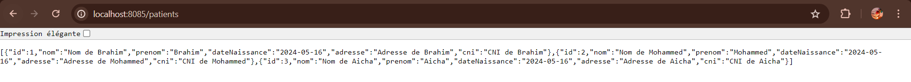
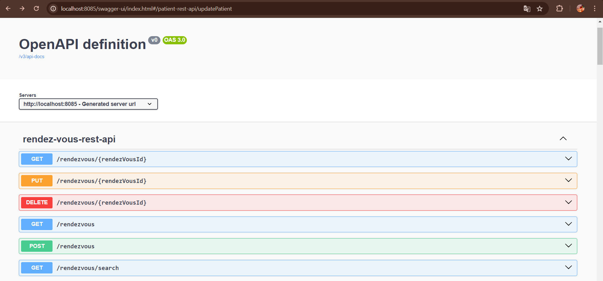

# Projet Innovation - Gestion de Patients et de Consultations

## Introduction

Ce projet vise à créer un système de gestion de patients et de consultations pour les professionnels de la santé. Il permet de stocker et de gérer les informations sur les patients, les médecins, les rendez-vous et les consultations médicales.

## Couches de l'Application

### DAO (Data Access Object)

La couche DAO est responsable de l'accès aux données de la base de données. Elle comprend les entités Java qui représentent les données et les interfaces Repository qui fournissent un accès aux données à travers Spring Data JPA.

#### Entités

- **Patient**: Représente les informations sur un patient.
- **Medecin**: Représente les informations sur un médecin.
- **DossierMedical**: Contient les informations sur le dossier médical d'un patient.
- **RendezVous**: Représente un rendez-vous entre un patient et un médecin.
- **Consultation**: Représente une consultation effectuée par un médecin pour un patient.

#### Repositories

- **PatientRepository**: Pour accéder aux données des patients.
- **MedecinRepository**: Pour accéder aux données des médecins.
- **DossierMedicalRepository**: Pour accéder aux données des dossiers médicaux.
- **RendezVousRepository**: Pour accéder aux données des rendez-vous.
- **ConsultationRepository**: Pour accéder aux données des consultations.

### Services

La couche Services permet de manipuler les données à travers des DTOs (Data Transfer Objects). Elle encapsule la logique métier et fournit des opérations CRUD pour chaque entité.

#### Fonctionnalités ajoutées

- **PatientService**: Opérations pour créer, récupérer, mettre à jour et supprimer un patient. Permet également de rechercher des patients.
- **MedecinService**: Opérations pour gérer les médecins, y compris la recherche par terme.
- **DossierMedicalService**: Opérations pour gérer les dossiers médicaux des patients.
- **RendezVousService**: Opérations pour gérer les rendez-vous entre les patients et les médecins.
- **ConsultationService**: Opérations pour gérer les consultations médicales.

# Couche Web

La couche Web de l'application est responsable de l'exposition des fonctionnalités de l'application via des API RESTful. Cette couche utilise les contrôleurs REST API pour gérer les requêtes HTTP et les réponses pour effectuer les opérations CRUD (Create, Read, Update, Delete) sur les ressources de l'application.

## Contrôleurs REST API

Les contrôleurs REST API ont été créés pour chaque entité de l'application afin de fournir des endpoints pour manipuler les données. Voici les principaux contrôleurs REST API de l'application :

- `PatientRestAPI`: Gère les opérations CRUD sur les patients.
- `MedecinRestAPI`: Gère les opérations CRUD sur les médecins.
- `DossierMedicalRestAPI`: Gère les opérations CRUD sur les dossiers médicaux.
- `ConsultationRestAPI`: Gère les opérations CRUD sur les consultations.
- `RendezVousRestAPI`: Gère les opérations CRUD sur les rendez-vous.

### Test

Pour consulter la documentation API :
http://localhost:8085/v3/api-docs

